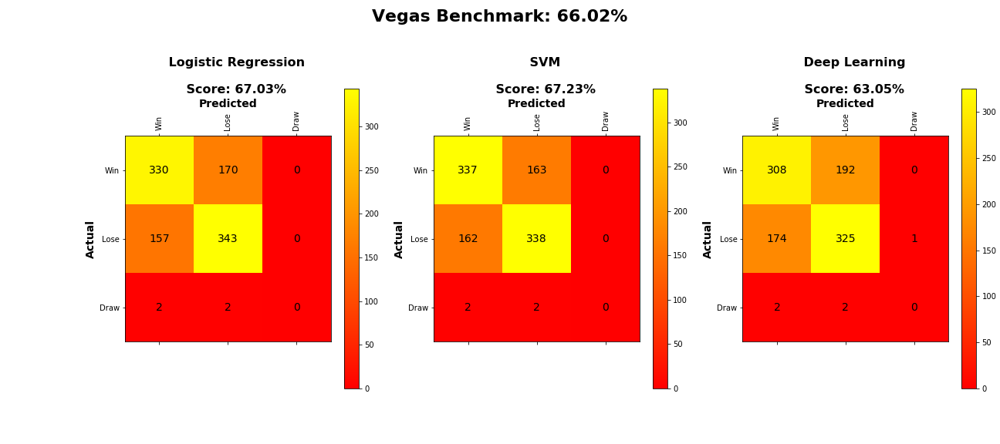

# NFL_ML_game_predictor

## Description
Using machine learning models to classify(Win, Lose, Draw) the outcome of NFL games and compare to Vegas success rate

## Data Sources

## Results
When comparing Logistic Regression, Support Vector Machine, and Deep Neural Networks to predict the outcome of an NFL game using our dataset of features we found that the Support Vector Machine model performed the best.  

